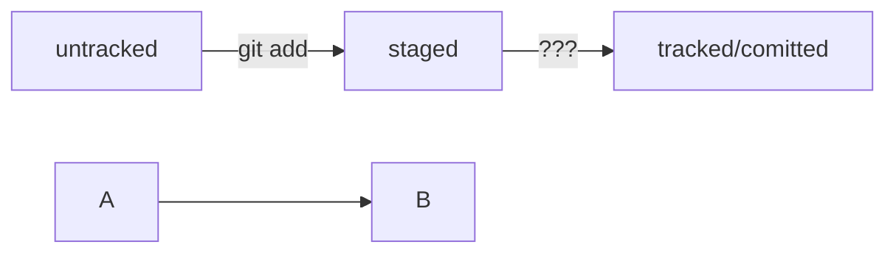

# Тренировочный проект для работы с Git.

# Шпаргалка по Git

Инициализировать репозиторий можно с помощью команды _**git init**_.
Проверить статус, или состояние, репозитория поможет команда _**git status**_.
Если вы ошиблись и случайно инициализировали не ту папку, можно «разгитить» её — удалить скрытую подпапку _**.git**_.

Команда _**git add**_ позволяет подготовить файл к сохранению.
Команда _**git add --all**_ подготовит к сохранению сразу все файлы.
С помощью _**git add .**_ можно добавить в репозиторий текущую папку со всеми файлами.

Коммит можно сделать с помощью команды _**git commit**_.
_Ключ -m позволяет присвоить коммиту сообщение. Помните, что такие сообщения должны быть информативными: чётко описывать изменения.
В коммит попадает то, что было предварительно добавлено «в корзину», или «в кадр», перед коммитом.

Команда git log — используйте её, чтобы оглянуться назад и посмотреть коммиты.

Команда связывает удалённый репозиторий с локальным - _**git remote add**_

Коммиты хранятся в ветках. Начальная ветка создаётся автоматически и называется main или master.
За отправку изменений на удалённый репозиторий отвечает команда _**git push**_.
Интерфейс GitHub позволяет удобно просмотреть все коммиты в репозитории, а также изменения в этих коммитах.

Git преобразует информацию о коммитах с помощью алгоритма SHA-1 и для каждого из них рассчитывает уникальный идентификатор — хеш.
Хеш — основной идентификатор коммита и позволяет узнать его автора, дату и содержимое закоммиченных файлов.
Все хеши, а также таблицу соответствий хеш → информация о коммите Git хранит в папке .git.

Можно вызвать не только полный лог, но и сокращённый — это делается командой _**git log --oneline**_.

В числе прочих файлов в папке .git есть служебный файл HEAD. Он указывает на самый свежий коммит.
Вместо хеша последнего коммита можно написать слово HEAD — Git вас поймёт.

Статусом untracked помечается файл, о существовании которого Git знает, но не следит за изменениями в нём. Этот статус — противоположность tracked, в который попадают все файлы, отслеживаемые Git.
Файл переходит в статус staged после выполнения git add.
Статус modified означает, что файл был изменён.
Большинство файлов в проектах «шагает» по следующему циклу: «изменён» → «добавлен в список на коммит» → «закоммичен» → «изменён» → и так далее.




## Код команд
```
git init
git status
git add
git add --all
git commit
git push
git log
git log --oneline
```
# Откат изменений
- Выполнить unstage изменений — git restore --staged <file>
- «Откатить» коммит — git reset --hard <commit hash>
- «Откатить» изменения, которые не попали ни в staging, ни в коммит, — git restore <file>


# Шпаргалка markdown

## Выделение текста

Вы можете выделять текст в markdown с помощью символов `_` или `*`. Например:

Пример _курсива_ и **жирного** текста.

## Заголовки

Заголовки можно создавать с помощью символа `#`. Чем больше `#`, тем меньше заголовок. Например:

# Заголовок первого уровня
## Заголовок второго уровня
### Заголовок третьего уровня

## Выделение кода

Чтобы выделить текст как код, поместите его в тройные кавычки `````. 

```
mkdir my_project
cd my_project
git init
```
Это лишь некоторые функции markdown.
