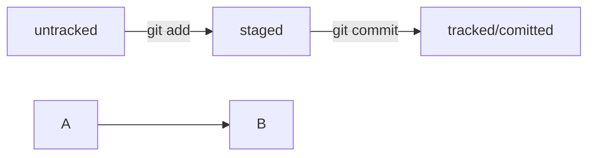

# Тренировочный проект для работы с Git.

# Шпаргалка по Git

## Инициализация

- Инициализировать репозиторий можно с помощью команды _**git init**_.
- Проверить статус, или состояние, репозитория поможет команда _**git status**_.
- Если вы ошиблись и случайно инициализировали не ту папку, можно «разгитить» её — удалить скрытую подпапку _**.git**_.

## Подготовка к "коммиту" (перевод файла в статус "staged")
 
Команда _**git add**_ позволяет подготовить файл к сохранению.
Команда _**git add --all**_ подготовит к сохранению сразу все файлы.
С помощью _**git add .**_ можно добавить в репозиторий текущую папку со всеми файлами.

## Коммит, коммит, еще коммит

- Коммит можно сделать с помощью команды _**git commit**_.
- Ключ -m позволяет присвоить коммиту сообщение. Помните, что такие сообщения должны быть информативными: чётко описывать изменения.
- В коммит попадает то, что было предварительно добавлено «в корзину», или «в кадр», перед коммитом.
- Команда _**git log**_ — используйте её, чтобы оглянуться назад и посмотреть коммиты.
- _**git push**_ (от англ. push, «толкать») — добавь изменения в удалённый репозиторий.

## Добавление изменений в последний коммит
_**git commit --amend --no-edit**_ (от англ. amend, «исправить») — добавь изменения к последнему коммиту и оставь сообщение прежним;
_**git commit --amend -m "Новое сообщение"**_ — измени сообщение к последнему коммиту на Новое сообщение.
- Выйти из редактора Vim: _нажать Esc, ввести :qa!, нажать Enter_S.

## Отправка на удаленный репозиторий

Команда связывает удалённый репозиторий с локальным - _**git remote add**_

Коммиты хранятся в ветках. Начальная ветка создаётся автоматически и называется **main** или **master**.
За отправку изменений на удалённый репозиторий отвечает команда _**git push**_.
Интерфейс GitHub позволяет удобно просмотреть все коммиты в репозитории, а также изменения в этих коммитах.

**git remote add origin https://github.com/YandexPracticum/first-project.git** (от англ. remote, «удалённый» + add, «добавить») — привяжи локальный репозиторий к удалённому с URL https://github.com/YandexPracticum/first-project.git;
**git remote -v** (от англ. verbose, «подробный») — проверь, что репозитории действительно связались;
**git push -u origin main** (от англ. push, «толкать») — в первый раз загрузи все коммиты из локального репозитория в удалённый с названием origin.
Ваша ветка может называться master, а не main. Подправьте команду, если это необходимо.
**git push** (от англ. push, «толкать») — загрузи коммиты в удалённый репозиторий после того, как он был привязан с помощью флага -u.

## Хэши

Git преобразует информацию о коммитах с помощью алгоритма SHA-1 и для каждого из них рассчитывает уникальный идентификатор — хеш.
Хеш — основной идентификатор коммита и позволяет узнать его автора, дату и содержимое закоммиченных файлов.
Все хеши, а также таблицу соответствий хеш → информация о коммите Git хранит в папке .git.

Команда _**git log**_ — используйте её, чтобы оглянуться назад и посмотреть коммиты.
Можно вызвать не только полный лог, но и сокращённый — это делается командой _**git log --oneline**_.

В числе прочих файлов в папке **.git** есть служебный файл **HEAD**. Он указывает на самый свежий коммит.
Вместо хеша последнего коммита можно написать слово HEAD — Git вас поймёт.

## Сравнение

- Команда _**git diff**_ сравнит последнюю закоммиченную версию файла с той, что находится в состоянии modified.
- Команда _**git diff --staged**_ покажет изменения в staged-файлах относительно последних закоммиченных версий.
- _**git diff**_ может сравнивать ветки по их названиям.
	Например, команда _**git diff main feature/my-feature**_ выведет разницу между основной веткой и веткой feature/my-feature.
- Git поддерживает суффикс навигации **~**. С его помощью можно сослаться на предыдущие коммиты. Например, если вы находитесь в ветке main и хотите вывести разницу между тем коммитом, который был три коммита назад, и текущим, нужно выполнить git diff main~3 main.

## Откат изменений
- Выполнить unstage изменений — _**git restore --staged <file>**_.
- «Откатить» коммит — _**git reset --hard <commit hash>**_.
- «Откатить» изменения, которые не попали ни в staging, ни в коммит, — _**git restore <file>**_.

## Статусы

Статусом untracked помечается файл, о существовании которого Git знает, но не следит за изменениями в нём. Этот статус — противоположность tracked, в который попадают все файлы, отслеживаемые Git.
Файл переходит в статус staged после выполнения git add.
Статус modified означает, что файл был изменён.
Большинство файлов в проектах «шагает» по следующему циклу: «изменён» → «добавлен в список на коммит» → «закоммичен» → «изменён» → и так далее.

## Игнорирование файлов в Git

- Если нужно, чтобы Git игнорировал какие-то файлы, стоит составить файл _**.gitignore**-.
- Посмотреть, что игнорируется, можно с помощью команды git status --ignored.
- Сам файл _**.gitignore**_ — это обычный файл в репозитории. Его тоже стоит закоммитить.
- Шаблонов много, но их легко найти в интернете вместе с примерами использования.

## Клонирование репозитория
- Команда -**git clone**_ копирует проект на локальный компьютер.
- _**git clone**_ автоматически связывает локальный репозиторий с удалённым.

## Ветки
- Ветка — это последовательность независимых изменений.
- Благодаря веткам несколько человек могут работать над одним репозиторием и не мешать друг другу. А ещё ветки помогают декомпозировать большую и страшную задачу на маленькие и понятные.
- Основная версия проекта хранится в главной ветке **main** (или **master**).
- С помощью команды _**git branch**_ можно посмотреть, какие в проекте есть ветки и в какой из них вы сейчас находитесь.
- Команда _**git checkout <название_ветки>**_ позволяет переключаться на другую ветку.
 -Разные ветки в одном проекте существуют независимо. Изменения в одной не влияют на изменения в другой.
- В Git можно создать ветку и сразу же перейти в неё командой _**git checkout -b <название_ветки>**_.
- Ветка указывает на коммит, который сделан в ней последним. При этом две ветки могут ссылаться на один и тот же коммит — например, если вы только что создали ветку, но ещё не успели внести в неё коммит.
- Выполнить слияние веток позволяет команда _**git merge <название_ветки>**_. В качестве параметра указывают название ветки, которую нужно влить в текущую.
- Удалять ненужные ветки после слияния — хорошая практика. Так в вашем репозитории всегда будет порядок. За удаление веток отвечает команда _**git branch -D <название_ветки>**_ и её щадящий вариант с флагом -d.

## Теститорование работы со схемой (графы)



## Код команд
```
git init
git status
git add
git add .
git add --all
git commit -m "Massage"
git push
git log
git log --oneline
git diff
git branch
git branch -D <NAMEOFBRANCH>
git branch -d <NAMEOFBRANCH>
git chekout <NAMEOFBRANCH>
git checkout -b <NAMEOFBARNCH>
gir merge
```

# Шпаргалка markdown

## Выделение текста

Вы можете выделять текст в markdown с помощью символов `_` или `*`. Например:

Пример _курсива_ и **жирного** текста.

## Заголовки

Заголовки можно создавать с помощью символа `#`. Чем больше `#`, тем меньше заголовок. Например:

# Заголовок первого уровня
## Заголовок второго уровня
### Заголовок третьего уровня

## Выделение кода

Чтобы выделить текст как код, поместите его в тройные кавычки `````. 

```
mkdir my_project
cd my_project
git init
```
Это лишь некоторые функции markdown.
